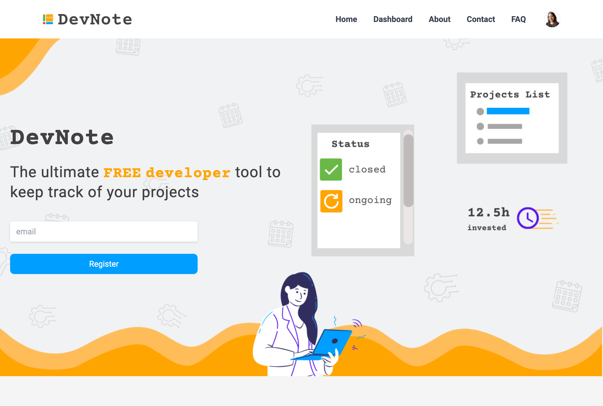
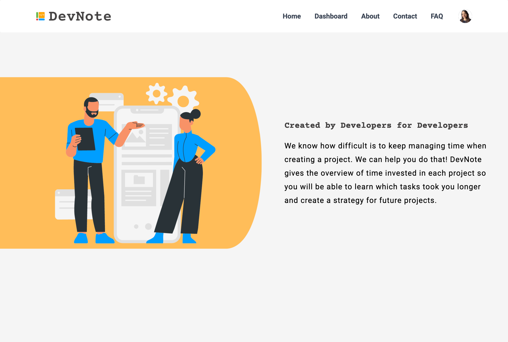
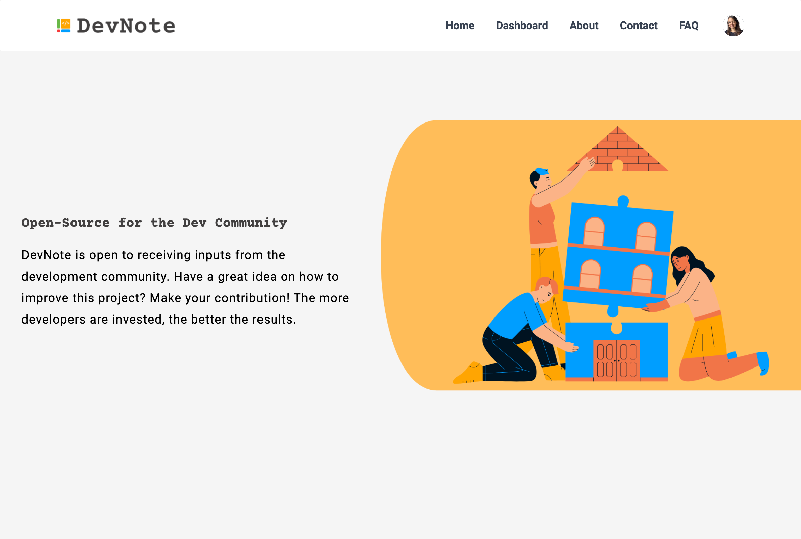
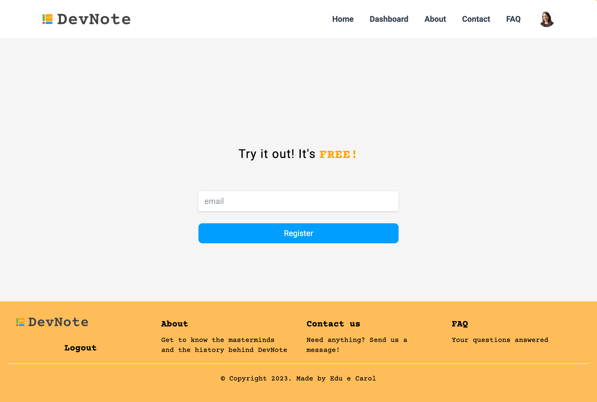

# DevNote - The Ultimate Developer Tool

DevNote is a Free platform where you can keep track of your development projects. With DevNote you can track the time invested in each project, have an overview of which projects are ongoing and which ones are closed, and most importantly learn to optimize your time and deliver by the deadline.

### Check out DevNote [here]( https://edukaki-devnote.netlify.app)

## Development Process

- Coming up with key concepts and functionalities;
- Sketching the logic behind DevNote;
- Implementation of functionalities using Firebase;
- Design the user interface;
- Content creation;
- Development of the user interface from a mobile-first perspective.

## Built with

- Semantic HTML5 markup;
- Tailwindcss framework;
- Flexbox;
- CSS Grid;
- Mobile-first workflow.

## Technologies and Tools

- [Firebase](https://firebase.google.com/)
- [React - JS library](https://reactjs.org/)
- [Tailwindcss](http://tailwindcss.com)

## Requirements

To work with the code, you will need, before you begin, to install in your machine Git and to have a source-code editor such as VSCode.
Please, also use ‘npm install’ command to install all dependencies such as React and Tailwindcss.

## What we learned

### How to create a context to listen when the user is logged in:

~~~
import { useContext, createContext } from "react";

const AuthContext = createContext()

export const AuthContextProvider = ({children}) => {

return (

{children}

)

}

export const UserAuth = () => {

return useContext(AuthContext)

~~~

### create a new provider inside auth context to login with google or even other providers:

~~~
import {

GoogleAuthProvider,

signInWithPopup,

signInWithRedirect,

signOut,

onAuthStateChanged

} from "firebase/auth";

//////////////////////////////////////////////////////////

const googleSignIn = () => {

const provider = new GoogleAuthProvider()

signInWithPopup(auth,provider)

}

~~~	

### Inside sign in page, the login method

~~~
const { googleSignIn } = UserAuth();

const handleGoogleSignIn = async () => {

try{

await googleSignIn()

}

catch(error){

console.log(error)

}

}

~~~

### inside auth context, add function to get the currently signed-in user:
~~~

useEffect(() => {

const unsubscribe = onAuthStateChanged(auth, (currentUser)=>{

setUser(currentUser)

})

return () => {

unsubscribe()

}

},[])

~~~

### inside the navbar , add function to handle the sign out
~~~
const handleSignOut = async () => {

try{

await logOut()

} catch(error){

console.log(error)

}

}

~~~

### Prevents a logged-in users from accessing the login page

~~~
const { googleSignIn, user } = UserAuth()

useEffect(() => {

if(user !== null){

navigate('/')

}

},[user])

~~~

### Component created to protect private pages from non-logged in users
~~~
import { Navigate } from "react-router-dom"

import { UserAuth } from "../../context/AuthContext"

const Protected = ({ children }) => {

const { user } = UserAuth()

if(!user){

return

}

return children

}

export default Protected;

~~~

## Useful resources
- [A guide to adding gradients with Tailwind CSS](https://blog.logrocket.com/guide-adding-gradients-tailwind-css/): This is a great article that helped us understand the different approaches and possibilities for adding gradients on elements using Tailwindcss. I'd recommend it to anyone still learning this concept.

## Acknowledgments
This is a project made by two developers as a team. We want our team to spend and receive your contribution.

### Made with :heart: by [Eduardo Arakaki] (https://www.linkedin.com/in/eduardo-arakaki/) and [Caroline Almeida Nikolic] (https://www.linkedin.com/in/carolinealmeidanikolic/)